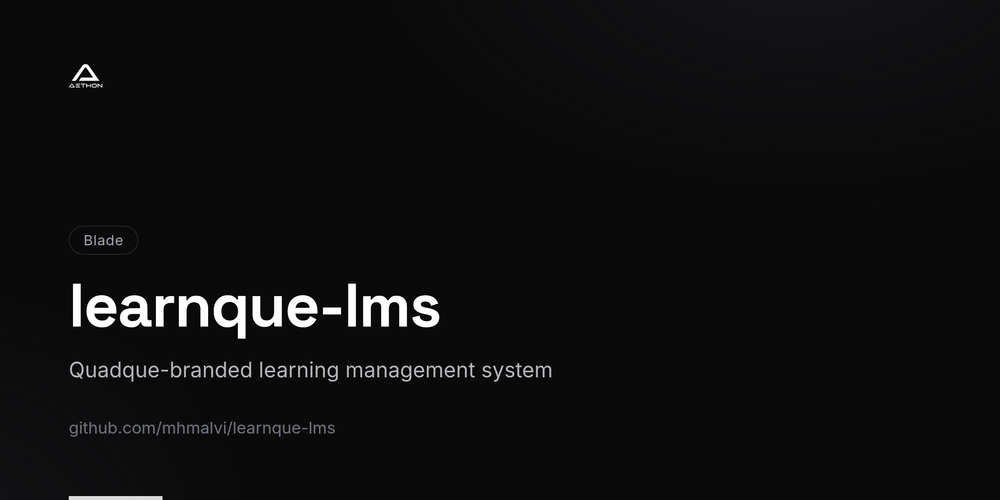

<!-- repo-card -->


# Learnque LMS

A comprehensive Learning Management System built for **Quadque Technologies**, providing a full-featured digital learning environment for students, teachers, and administrators.

## Overview

Learnque LMS is a web-based platform designed to manage online courses, virtual classrooms, and student enrollment workflows. It features a modern single-page application frontend powered by Vue.js with a robust Laravel backend API.

## Tech Stack

| Layer       | Technology                                      |
|-------------|--------------------------------------------------|
| Backend     | PHP 7.3+ / 8.0, Laravel 8                       |
| Frontend    | Vue 3, Vuex, Tailwind CSS, Alpine.js             |
| Auth        | Laravel Sanctum, Laravel Breeze                  |
| Database    | MySQL (dual-database: primary + admin)           |
| Build Tools | Laravel Mix, Webpack                             |
| Containers  | Docker (docker-compose.yml)                      |
| Testing     | PHPUnit, Mockery                                 |

## Key Features

### Course Management
- Create, update, and categorize courses
- Rich-text course content with media support
- Course enrollment and progress tracking

### Virtual Classrooms
- Classroom creation and management
- Post publishing with file attachments (Google File Picker integration)
- Student and teacher membership management
- Real-time classroom post feeds

### User Management
- Multi-role authentication (Admin, Teacher, Student)
- Separate admin authentication system
- User profile management with image uploads
- Student enrollment workflows

### Admin Dashboard
- Dedicated admin panel with role-based access
- Student and teacher CRUD operations
- Category and course management
- Classroom oversight and member management

### API Layer
- RESTful API endpoints for course data
- Token-based authentication via Laravel Sanctum
- JSON resource transformations for clean API responses

## Project Structure

```
app/
├── Http/Controllers/
│   ├── Admin/          # Admin panel controllers
│   ├── Api/            # REST API controllers
│   ├── Auth/           # Authentication controllers
│   └── Student/        # Student-specific controllers
├── Models/             # Eloquent models (Course, Classroom, User, etc.)
├── Http/Requests/      # Form request validation
└── Http/Resources/     # API resource transformations
resources/js/
├── components/         # Vue 3 SPA components
│   ├── Auth/           # Login components
│   ├── Classrooms/     # Classroom management UI
│   ├── Courses/        # Course CRUD components
│   ├── Users/          # User management components
│   └── Home/           # Dashboard components
└── store/              # Vuex state management
routes/
├── admin.php           # Admin panel routes
├── student.php         # Student routes
├── api.php             # API routes
└── web.php             # Web routes
```

## Prerequisites

- PHP >= 7.3
- Composer
- Node.js & npm
- MySQL
- Docker (optional)

## Installation

1. **Clone the repository**
   ```bash
   git clone https://github.com/mhmalvi/learnque-lms.git
   cd learnque-lms
   ```

2. **Install dependencies**
   ```bash
   composer install
   npm install
   ```

3. **Configure environment**
   ```bash
   cp .env.example .env
   php artisan key:generate
   ```

4. **Set up databases**

   Configure both the primary and admin database connections in `.env`:
   ```
   DB_DATABASE=learnque
   DB_DATABASE_ADMIN=quadmin
   ```

5. **Run migrations**
   ```bash
   php artisan migrate
   ```

6. **Build frontend assets**
   ```bash
   npm run dev        # Development
   npm run production # Production
   ```

7. **Start the server**
   ```bash
   php artisan serve
   ```

   Or use Docker:
   ```bash
   docker-compose up -d
   ```

## License

This project is proprietary software developed for Quadque Technologies.